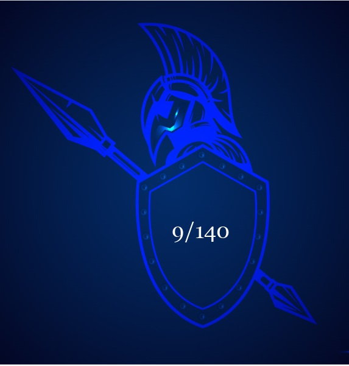
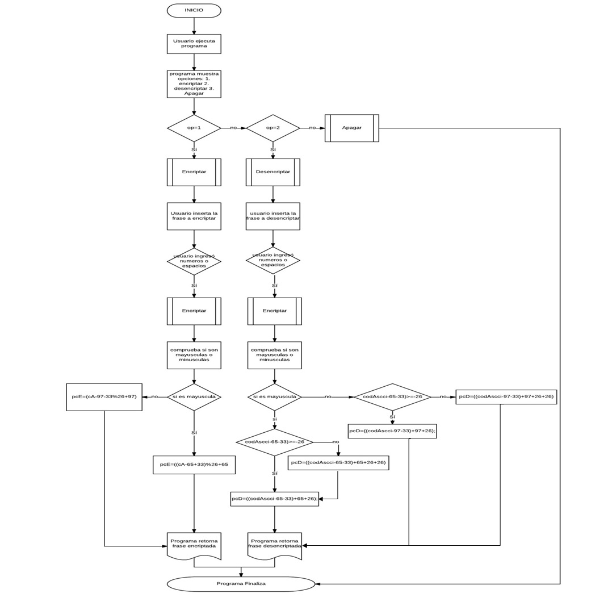

# CIFRADO CÉSAR

 Objetivos del Programa:

 Crea una web que pida, por medio de un prompt(), una frase al usuario y devuelva el mismo mensaje encriptado según el algoritmo de Cifrado César con el parámetro de desplazamiento de 33 espacios hacia la derecha

Por ejemplo:

Texto original: ABCDEFGHIJKLMNOPQRSTUVWXYZ

Texto codificado: HIJKLMNOPQRSTUVWXYZABCDEFG

Consideraciones Específicas

Tu programa debe ser capaz de cifrar y descifrar tanto letras mayúsculas como minúsculas. La fórmula para descifrar es: (x - n) % 26

Tu código debe estar compuesto por 2 funciones con los siguientes nombres: cipher y decipher 

El usuario no debe poder ingresar un campo vacío o que contenga números. 

## Diagrama de Flujo:

### Pseudocodigo
ALGORITMO Cifrado Cesar
1.     FUNCION isUpperCase(str)
2.        Mostrar  str = str.toUpperCase();
3.     FIN FUNCION
4.     FUNCION cipher(string)
5.           Definir  encryptedCharacterPosition = 0;  newString = “”; encryptedWord= “”;
6.       SI (string.length === 0 || containsNumber(string)) ENTONCES
7.          Mostrar (“No estas ingresando una cadena, no ingreses campos vacíos ni números”);
8.       SINO
9.          PARA (  i = 0; i < string.length; i++)  HACER
10.              Definir asciiCode = string.charCodeAt(i);
11.         SI (isUpperCase(string)) ENTONCES
12.            encryptedCharacterPosition=((asciiCode-65+33) %26 + 65);
13.         SINO
14.            encryptedCharacterPosition=((asciiCode-97+33) % 26 + 97);
15.        FIN SI
16.            encrytedCharacter = String.fromCharCode(encryptedCharacterPosition);
17.         encryptedWord += encryptedCharacter;
18.       FIN PARA
19.         Mostrar encryptedWord;
20.     FIN SI
21.   FIN FUNCION
22.  FUNCION decipher(string)
23.        Definir  positionOfTheDecryptedCharacter  = 0; decryptedCharacter = “”;decryptedWord= “”;
24.     SI (string.length===0 || containsNumber(string)) ENTONCES
25.        Mostrar (“No estas ingresando una cadena, no ingreses campos vacíos ni números”);
26.     SINO
27.        PARA (  i = 0; i < string.length; i++)  HACER
28.            Definir asciiCode  = string.charCodeAt(i);
29.          SI (isUpperCase(string)) ENTONCES
30.              SI ((asciiCode i-65-33) >= -26) ENTONCES
31.                 positionOfTheDecryptedCharacter =(( asciiCode -65 -33) + 65 + 26);
32.              DE LO CONTRARIO SI ((asciiCode -65-33) < -26) ENTONCES
33.                 positionOfTheDecryptedCharacter =(( asciiCode -65-33) + 65 +26 +26);
34.         SINO
35.                 SI ((asciiCode -97-33)  >= -26) ENTONCES           
36.                      positionCharacterDecrypted=((asciiCode - 97- 33) + 97 + 26);
37.                   DE LO CONTRARIO ((asciiCode  -97 -33) < -26) ENTONCES
38.                         positionOfTheDecryptedCharacter = (( asciiCode -97 -33) + 97 + 26 +26);
39.                 FIN SI
40.          FIN SI
41.             decryptedCharacter  =String.fromCharCode(positionOfTheDecryptedCharacter);
42.             decryptedWord += decryptedCharacter
43.        FIN PARA
44.        Mostrar decryptedWord;
45.    FIN SI
46.  FIN FUNCION
47.  FUNCION containsNumber(string)
48.        Definir result = false;
49.    PARA (i = 0; i <string.length; i++) HACER
50.        Definir n = string.charAt(i);
51.       Result = !isNaN(parseFloat(n)) && isFinite(n);
52.    FIN PARA
53.     Mostrar result;
54.  FIN FUNCION
55. REPETIR (Menu)
56.       Definir op = 0;
57.       Definir strMenu = '1. Encriptar\n2. Desencriptar\n3. Apagar\n';
58.       Imprimir op = parseInt(prompt(strMenu));
59.       SI (op === 1) ENTONCES
60.           Imprimir var wordToEncrypt =prompt('Ingresa tu cadena a Encriptar:');
61.           Mostrar alert('Tu palabra encriptada es: '+ cipher(wordToEncrypt));
62.       SI (op === 2) ENTONCES
63.           Imprimir var wordToDecrypt = prompt('Ingresa tu cadena a Descencriptar:');
64.           Mostrar alert('Tu palabra descencriptada es: '+decipher(wordToDecrypt));
65.       FIN SI
66. HASTA QUE (op !== 3);
FIN ALGORITMO
